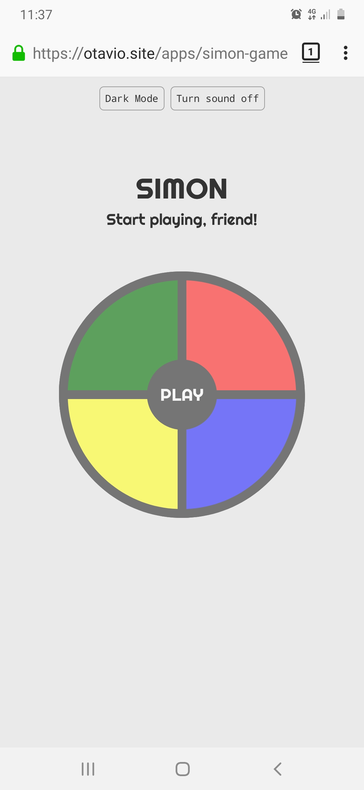
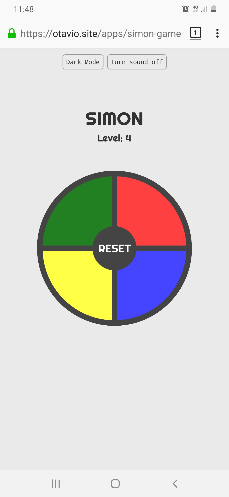
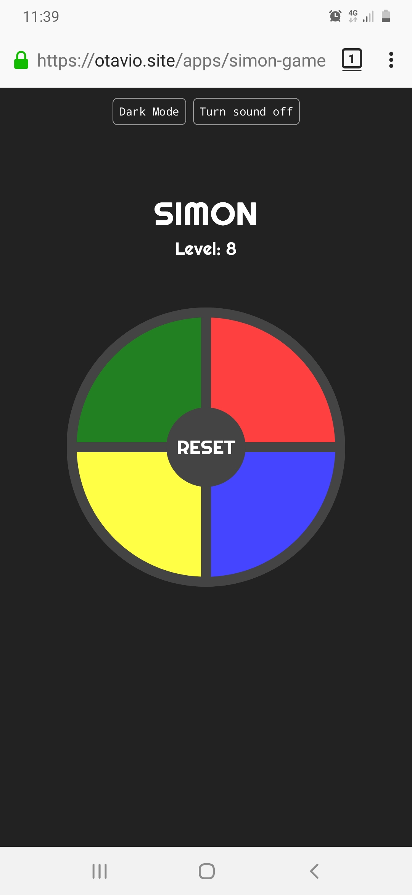
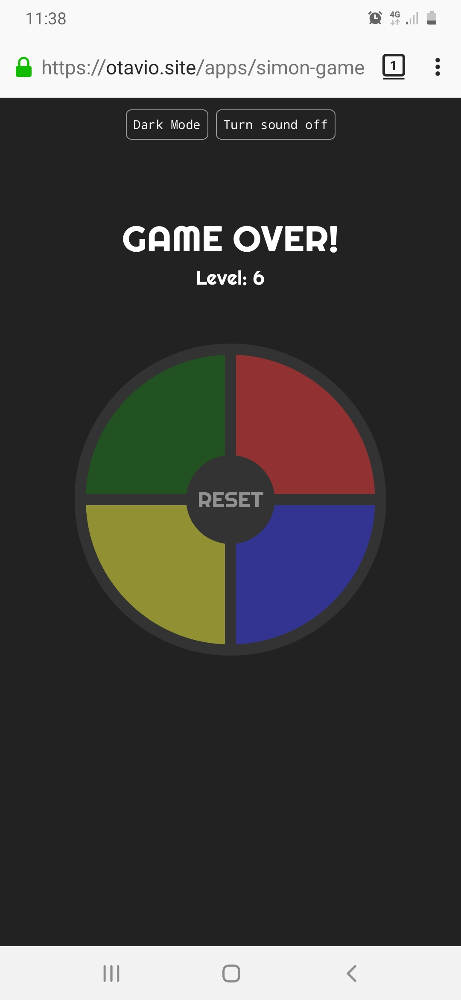

# The Simon Game 🎮

The original <a href="https://en.wikipedia.org/wiki/Simon_(game)" target="_blank">Simon Game</a> was created in 1978, inspired by an arcade game by Atari called Touch Me.

I've developed this game as a JavaScript/jQuery challenge at the Web Development Bootcamp by Angela Yu.

## Built with

- HTML
- Sass
- JavaScript
- jQuery

## Author

Otavio Petry https://www.linkedin.com/in/otaviopetry/

## Screenshots

 
 
 
 

